# Ejemplo de Login para Aplicación Android

Esta aplicación Android incluye **login**, **registro de usuarios** y **perfil de usuario**, junto con elementos modernos de interfaz como **AppBar**, **WebView** y **SwipeRefreshLayout**.

---

## Pantallas de la aplicación

### Login y Registro
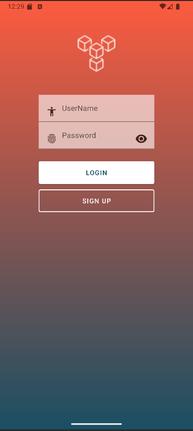  
Pantalla de **login**, donde el usuario ingresa sus credenciales para acceder a la aplicación.

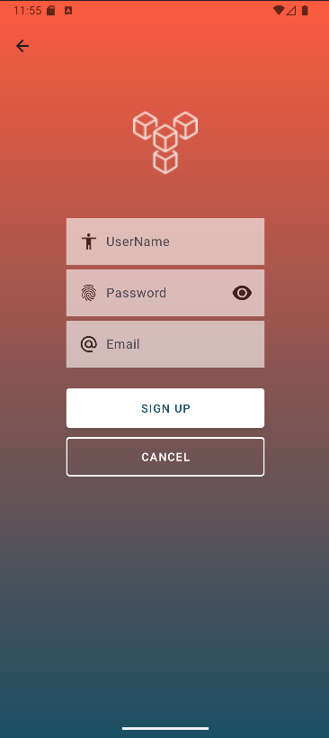  
Pantalla de **registro**, donde un nuevo usuario puede crear su cuenta.

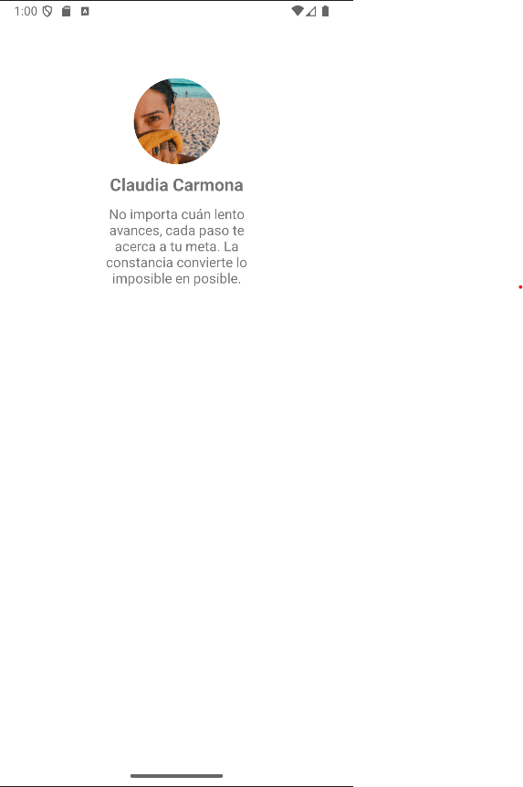  
Pantalla de **perfil**, donde se muestran los datos del usuario una vez que ha iniciado sesión.

---

### AppBar y navegación
  
La **AppBar** principal de la aplicación, que proporciona navegación y acceso a opciones importantes.

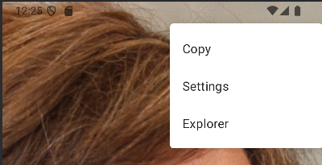  
Pantalla que se muestra al seleccionar una opción de la **AppBar**, mostrando submenús.

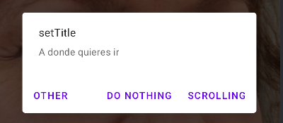  
Pantalla que se abre al seleccionar una opción dentro de la pantalla anterior, mostrando las opciones.

---

Estoy modificando el readme de xinbo

---
### SwipeRefreshLayout
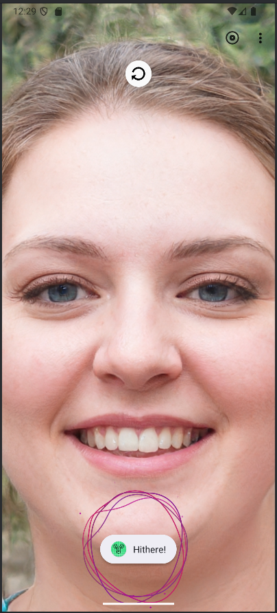  
Ejemplo de **SwipeRefreshLayout**, que permite actualizar contenido dinámicamente al deslizar hacia abajo.
También podemos ver una animacion de la libreria **lottie**, que muestra una animacion de un wave.

---

---
### Landscape
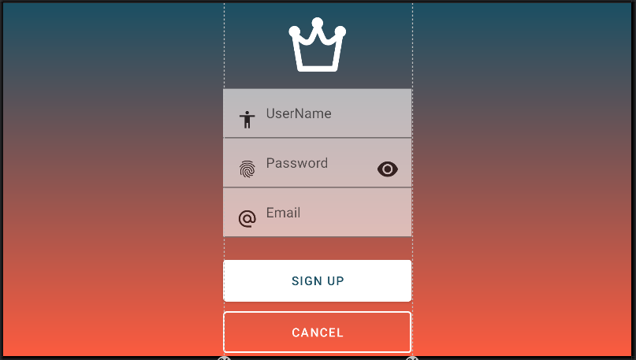  
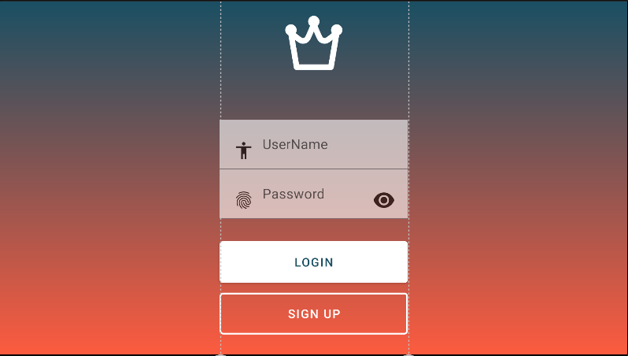  
Implementacion de la vista apaisado y ajustes especificos de éste para que se muestre de manera armoniosa

---

---
### Locale
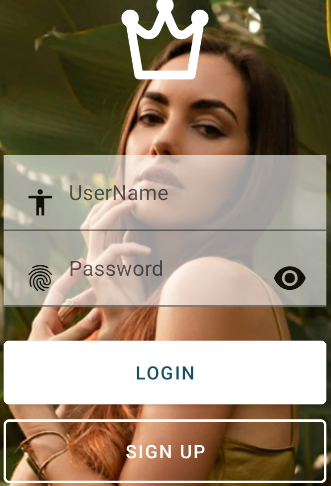  
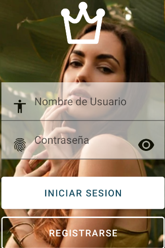  
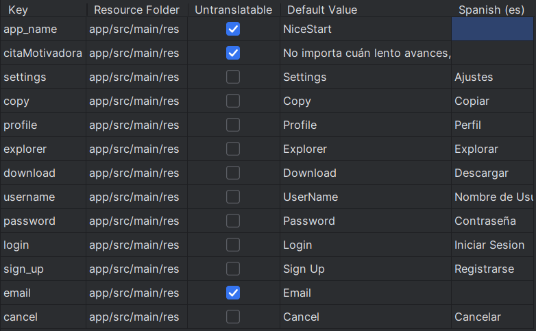  
También se ha tenido en cuenta las distintas configuraciones locales del dispositivo en funcion del idioma

---

---
### Modo oscuro
  
   
Mas configuraciones sobre cómo se muestra nuestra aplicacion según ahora si el usuario tiene modo claro u oscuro

---

## Licencia

Este repositorio está bajo la licencia:  
[Creative Commons Attribution-ShareAlike 4.0](https://creativecommons.org/licenses/by-sa/4.0)
